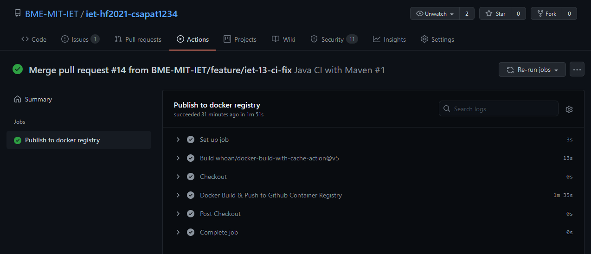
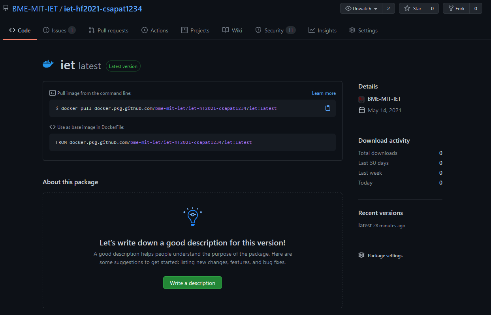

# CI pipeline összeállítása
Kedves Áron Csanád - akedves

## Feladat
Mivel az eredeti basil projecten nem volt beüzemelve Continous Integration, ezért úgy döntöttünk, hogy megvalósítjuk. Olyan konfigurácós fájlok megalkotására volt szükség, amely tartalmazza a pipeline lépéseit. Ennek a megvalósítása volt az én feladatom. 

## Megvalósítás
A fájl elhelyezése céljából létrehoztam a .github/workflows mappát, amelyben elhelyeztem a build.yml és publish.yml fájlokat. A build.yml összeállítása során a gyakorlaton is vett Java CI with Maven-ből indultam ki és azt fejlesztettem tovább. A publish.yml-nél pedig már magamtól állítottam össze az elérhető dokumnetációk alapján. Ezek tanulmányozásából nagyon sokat tanultam. 

## Eredmény
### build.yml
Pull-request esetén megpróbálja lefordítani a projektet Java 11-re. Amennyiben a fordítás sikertelen, jelzi a hiba fellépését. 

### publish.yml
Ha a master brach.re valaki push-ol (beleértve a pull-request mergelését), az összeállított docket konfiguráció segítségével docker image-et épít, és elhelyezi a container registry-be. 

