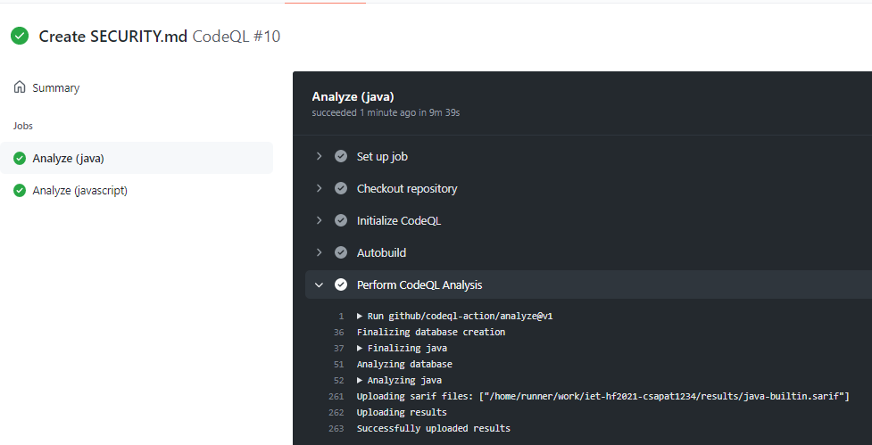
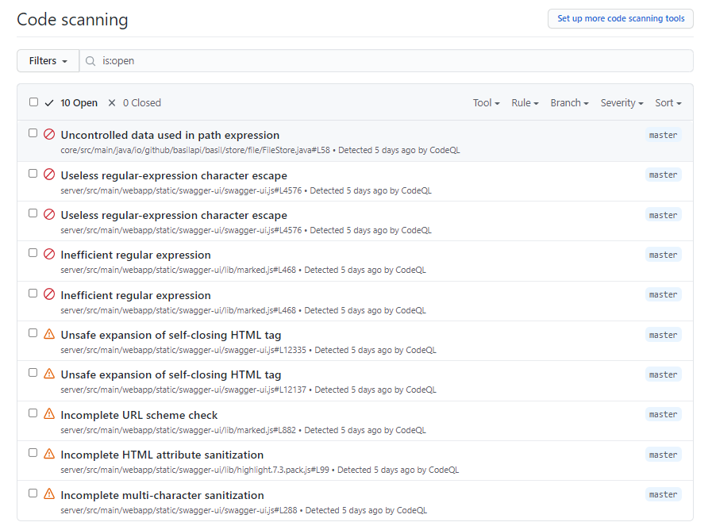

# CodeQL analízis beüzemelése
Kurdi Barnabás - TheBarner

## Feladat
A projekt biztonsági átvizsgálását kívántuk ellenőrizni, ehhez megfelelőnek bizonyult az open source CodeQL.

## Megvalósítás
A CodeQL analízis futtatásához létrehoztam a codeql-analysis.yml file-t. Ebben definiáltam, hogy a kódbázis Java és Javasceript nyelven íródott részeit analizálja. 

## Eredmény
A CodeQL minden main branch-re push és pull request esetén lefuttatja az analízist. A GitHub actionsnél látszik, hogy sikeresen lefut a biztonsági analízis.

Az analízis futásának eredménye a GitHub Security fülén található meg. 

Az analízis elindítását és beüzemelését meglepően egyszerűnek találtam, azt hittem, több probléma lesz vele. Az egyes Security Issue-knál nagyon részeltesen le van írva, hogy mi okozhat biztonsági rést. A CodeQL-t nagyon hasznosnak találom, és a jövőben éles környezetben is szívesen fogom használni.
