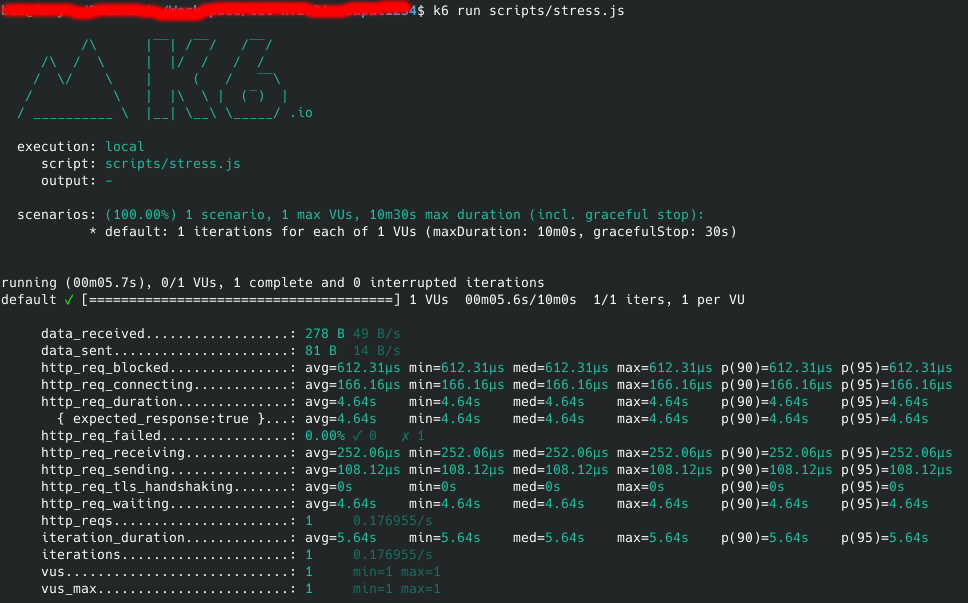

# Csapat1234

## Stresszteszt
A projekt stressztesztelését a [K6.io](https://k6.io/) eszközzel végeztük. A K6 egy ingyenes nyílt forráskódú alkalmazás, amelyet könnyen fel tudtunk használni a basil stressztesztelésére. Alkalmas még a teljesítmény monitorozására, de ezzel nem éltünk. 

A K6 egy nagyon jól dokumentált eszköz, így a telepítésével és használatával nem akadt gond. Telepítés után a K6 segítségével Javascript alapon lehet teszteket létrezhozni. A K6 futtatás után a teszt eredményét a tesztet elindító konzolban jeleníti meg.

A létrehozott stresszteszt:
```javascript
import http from "k6/http";
import { sleep } from "k6";

const API_BASE_URL = "http://localhost/basil";

export default function () {
    http.get(API_BASE_URL + '/');

    sleep(1)
}
```
Ezzel a paranccsal megismételhető a teszt:
```shell
k6 run ./scripts/stress.js
```
Az általunk végzett mérések eredménye:


## Biztonság
A projekt az [Apache Shiro](https://shiro.apache.org/) biztonsági keretrendszert használja a felhasználók kezelésére, aminek fejelsztéséért és karbantartásáért az [Apache Software Foundation](https://apache.org) felel. Széles körben elfogadott ipari standardeket használ, így feltételezhetően megfelel minden biztonsági kritériumnak.

A projektbe integrálása a hivatalos dokumentáció szerint történt, így vélhetőleg nem tartalmaz az [Apache Shiro](https://shiro.apache.org/) projekttől független sérülékenységi hibákat.

## Használhatóság
A basil telepítése és haszálata sajnos nem egyértelmű a kellően kimerítő dokumentáció hiánya miatt. A projekttel ismerkedés során nehézséget okozott a program telepítése és használata, mivel a projekt nem tartalmaz sem telepítési útmutatót sem példa kódokat. Az eredeti README utasításainak követésével a program nem volt futtatható a csoport tagjainak.

 A telepítést a docker bevezetésével sokkal egyszerűbbé és egyérelműbbe tette a csapat. Teljes adatbázis építés és konfigurálás helyett elégséges a dockert elindítni. 